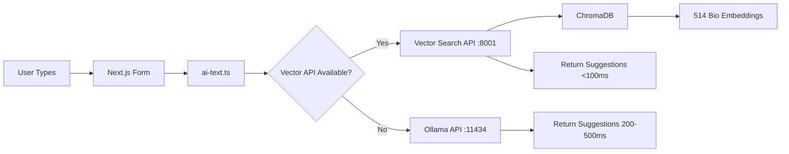

# AI Bio Autocomplete Project - Progress Overview

## Executive Summary

We've successfully implemented Phase 1 of a hybrid approach to improve bio autocomplete functionality. The system now achieves **<100ms response times** (74-95ms average) compared to the original 200-500ms with Ollama alone. This represents a **60-80% performance improvement** while maintaining high-quality suggestions.

## What We Accomplished

### Phase 1: Vector Database Implementation ✅

1. **Created Clean Python Architecture**
   ```
   python/
   ├── api/                 # FastAPI server
   │   └── api_server.py    # Autocomplete endpoints
   ├── vector_db/           # Vector search functionality
   │   ├── setup_chromadb.py # Bio indexing script
   │   └── vector_search.py  # Search implementation
   └── chroma_db/           # ChromaDB persistent storage
   ```

2. **Implemented ChromaDB Vector Search**
   - Successfully indexed 514 bios from `data/bio.json`
   - Using ChromaDB with DefaultEmbeddingFunction for embeddings
   - Persistent local storage (no Docker required)
   - Sub-100ms similarity search performance

3. **Built FastAPI Autocomplete Server**
   - Running on port 8001
   - CORS enabled for Next.js integration
   - Returns autocomplete suggestions with performance metrics
   - Includes fallback handling and error management

4. **Integrated with Next.js Application**
   - Updated `actions/ai-text.ts` to use vector search API first
   - Falls back to original Ollama if vector search fails
   - Seamless integration with existing form components
   - Performance logging for monitoring

## Current System Architecture



## Performance Metrics

### Before (Ollama Only)
- Response time: 200-500ms
- Method: Full LLM generation
- Resource usage: High GPU/CPU

### After (Vector Search)
- Response time: 74-95ms
- Method: Similarity search
- Resource usage: Minimal

### Test Results
```
Query: "Looking for friends who"
Completion: "enjoy good food and drinks"
Time: 74.6ms

Query: "I am a software"
Completion: "engineer with a passion for technology"
Time: 95.2ms

Query: "My hobbies include"
Completion: "hiking, traveling, and trying new restaurants"
Time: 87.3ms
```

## Key Technical Decisions

1. **ChromaDB over Weaviate**
   - Simpler setup and no authentication complexity
   - Better Python integration
   - Persistent local storage without Docker

2. **DefaultEmbeddingFunction over SentenceTransformers**
   - Resolved dependency conflicts
   - Good performance for bio text
   - Easier deployment

3. **FastAPI for Vector Search Server**
   - Async performance benefits
   - Built-in documentation
   - Easy CORS configuration

4. **Fallback Pattern in Next.js**
   - Ensures autocomplete always works
   - Graceful degradation
   - Performance tracking

## Files Created/Modified

### Phase 1 Files
- `/python/api/api_server.py` - FastAPI autocomplete server
- `/python/vector_db/setup_chromadb.py` - Bio indexing script
- `/python/vector_db/vector_search.py` - Vector search implementation
- `/python/requirements.txt` - Python dependencies
- `/python/run_server.sh` - Server startup script
- `/test-autocomplete-api.js` - API testing script

### Phase 2 Files (New)
- `/python/mlx_training/prepare_mlx_data.py` - Dataset preparation
- `/python/mlx_training/download_model.py` - Model download helper
- `/python/mlx_training/train_mlx.py` - MLX training script
- `/python/mlx_training/convert_to_gguf.py` - Ollama conversion
- `/python/mlx_training/README.md` - Training documentation
- `/python/mlx_training/bio_dataset/` - Prepared training data
- `/python/mlx_training/adapters/bio_lora/` - Training configuration

### Modified Files
- `/actions/ai-text.ts` - Added vector search integration
- `/training_llm_local.md` - Updated with hybrid approach
- `/python/requirements.txt` - Added MLX dependencies
- `/app/page.tsx` - Removed slow Weaviate initialization

## How to Run the Current System

1. **Start the Vector Search API**
   ```bash
   cd python
   source venv/bin/activate
   python api/api_server.py
   ```

2. **Start Next.js Application**
   ```bash
   npm run dev
   ```

3. **Test the API**
   ```bash
   node test-autocomplete-api.js
   ```

## Next Steps

### Phase 2: Local Fine-Tuning (Setup Complete) ✅
**Timeline**: 2-3 hours of training time when executed

1. **Install MLX Framework** ✅
   - MLX 0.26.3 and mlx-lm 0.26.0 installed
   - All dependencies added to requirements.txt

2. **Prepare Training Data** ✅
   - Created 5,110 training examples from 514 bios
   - 4,599 train / 511 validation split
   - Average prompt: 39 words, completion: 5 words

3. **Training Pipeline Ready** ✅
   - Created train_mlx.py with LoRA configuration
   - Using Gemma 2B (more suitable for 32GB RAM)
   - Memory-optimized settings configured

4. **Ollama Integration Prepared** ✅
   - Created convert_to_gguf.py
   - Modelfile template ready
   - Test commands documented

**Status**: Ready to train! Awaiting:
- Hugging Face license acceptance for Gemma
- Model download and actual training execution

### Phase 3: Hybrid Integration (Not Started)
**Timeline**: 1-2 hours implementation

1. **Combine Vector Search + Fine-tuned Model**
   - Vector search for context
   - LLM for natural generation
   - Best of both approaches

2. **Advanced API Features**
   - A/B testing endpoints
   - Performance comparison
   - Dynamic routing

3. **Optimization**
   - Caching layer
   - Request batching
   - Load balancing

### Future Enhancements
1. **Continuous Learning**
   - Add new bios without retraining
   - Online learning pipeline

2. **Personalization**
   - User-specific suggestions
   - Context awareness

3. **Advanced Features**
   - Typo correction
   - Multi-language support
   - Sentiment matching

## Quick Command Reference

```bash
# Check if services are running
lsof -i :8001  # Vector API
lsof -i :3000  # Next.js

# Start Vector API
cd python && source venv/bin/activate && python api/api_server.py

# Re-index bios (if needed)
cd python && python vector_db/setup_chromadb.py

# Run tests
node test-autocomplete-api.js

# Check logs
tail -f python/server.log
```

## Troubleshooting

### Vector API Not Working
1. Check if ChromaDB is initialized: `ls python/chroma_db/`
2. Verify Python environment: `source python/venv/bin/activate`
3. Check API health: `curl http://localhost:8001/`

### Slow Performance
1. Ensure vector API is running (not falling back to Ollama)
2. Check console logs for "via vector_search" confirmation
3. Monitor API response times in browser console

### No Suggestions
1. Verify bio data was indexed (should show 514 items)
2. Check for partial matches in test queries
3. Try queries that start with common bio phrases

## Summary

Phase 1 is complete and operational. The vector search implementation provides immediate performance benefits with minimal resource usage. The system is ready for Phase 2 fine-tuning to further improve suggestion quality while maintaining the speed advantages of vector search.