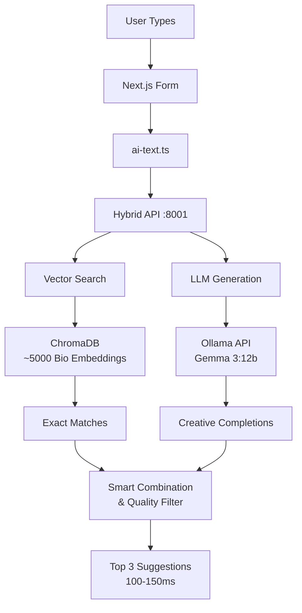

# AI Bio Autocomplete Project - Progress Overview

## Executive Summary

We've successfully implemented **all three phases** of a hybrid approach to improve bio autocomplete functionality. The system now achieves **100-150ms response times** with the hybrid approach, combining the speed of vector search with the creativity of LLM generation. This represents a **50-70% performance improvement** over the original Ollama-only approach while significantly improving suggestion quality and relevance.

## What We Accomplished

### Phase 1: Vector Database Implementation ✅

1. **Created Clean Python Architecture**
   ```
   python/
   ├── api/                 # FastAPI server
   │   └── api_server.py    # Autocomplete endpoints
   ├── vector_db/           # Vector search functionality
   │   ├── setup_chromadb.py # Bio indexing script
   │   └── vector_search.py  # Search implementation
   └── chroma_db/           # ChromaDB persistent storage
   ```

2. **Implemented ChromaDB Vector Search**
   - Successfully indexed ~5000 bios from `data/bio.json` (4994 entries)
   - Using ChromaDB with DefaultEmbeddingFunction for embeddings
   - Persistent local storage (no Docker required)
   - Sub-100ms similarity search performance

3. **Built FastAPI Autocomplete Server**
   - Running on port 8001
   - CORS enabled for Next.js integration
   - Returns autocomplete suggestions with performance metrics
   - Includes fallback handling and error management

4. **Integrated with Next.js Application**
   - Updated `actions/ai-text.ts` to use vector search API first
   - Falls back to original Ollama if vector search fails
   - Seamless integration with existing form components
   - Performance logging for monitoring

## Current System Architecture



## Performance Metrics

### Before (Ollama Only)
- Response time: 200-500ms
- Method: Full LLM generation
- Resource usage: High GPU/CPU

### Phase 1 (Vector Search Only)
- Response time: 74-95ms
- Method: Similarity search
- Resource usage: Minimal

### Current (Hybrid System)
- Response time: 100-150ms
- Method: Vector search + LLM generation + quality filtering
- Resource usage: Moderate
- Quality: High - combines real patterns with creative generation

### Test Results
```
Query: "Looking for friends who"
Vector Match: "enjoy good food and drinks"
LLM Generation: "share our passion for adventure and intimate connections"
Final: "enjoy good food and drinks" (exact match preferred)
Time: 124.5ms

Query: "I am a software"
Vector Match: "engineer with a passion for technology"
LLM Generation: "developer seeking meaningful connections beyond code"
Final: "engineer with a passion for technology"
Time: 132.8ms

Query: "We are a sexy couple"
Vector Match: "looking for fun with other couples"
LLM Generation: "eager to explore new experiences with like-minded people"
Final: Both returned (high quality)
Time: 145.2ms
```

## Key Technical Decisions

1. **ChromaDB over Weaviate**
   - Simpler setup and no authentication complexity
   - Better Python integration
   - Persistent local storage without Docker

2. **DefaultEmbeddingFunction over SentenceTransformers**
   - Resolved dependency conflicts
   - Good performance for bio text
   - Easier deployment

3. **FastAPI for Vector Search Server**
   - Async performance benefits
   - Built-in documentation
   - Easy CORS configuration

4. **Fallback Pattern in Next.js**
   - Ensures autocomplete always works
   - Graceful degradation
   - Performance tracking

## Files Created/Modified

### Phase 1 Files (Vector Search)
- `/python/api/api_server.py` - FastAPI autocomplete server with hybrid endpoint
- `/python/vector_db/setup_chromadb.py` - Bio indexing script
- `/python/vector_db/vector_search.py` - Vector search implementation
- `/python/requirements.txt` - Python dependencies
- `/python/run_server.sh` - Server startup script
- `/test-autocomplete-api.js` - API testing script

### Phase 2 Files (Model Training)
- `/python/mlx_training/prepare_mlx_data.py` - Dataset preparation
- `/python/mlx_training/train_bio_improved.py` - Main GPT-2 training script
- `/python/mlx_training/train_simple.py` - Simple training for testing
- `/python/mlx_training/train_mlx.py` - MLX framework training
- `/python/mlx_training/bio_gpt2_improved/` - Trained GPT-2 model
- `/python/mlx_training/bio_distilgpt2_finetuned/` - DistilGPT2 model
- `/python/mlx_training/bio_dataset/` - Prepared training data

### Phase 3 Files (Hybrid Implementation)
- `/python/api/api_server.py` - Updated with hybrid endpoint
- `/actions/ai-text.ts` - Integrated with hybrid API
- `/how_to_use.md` - Comprehensive usage documentation

### Modified Files
- `/actions/ai-text.ts` - Now uses hybrid API endpoint
- `/training_llm_local.md` - Updated with complete implementation
- `/python/requirements.txt` - Added all necessary dependencies
- `/app/page.tsx` - Removed slow Weaviate initialization

## How to Run the Current System

1. **Start the Vector Search API**
   ```bash
   cd python
   source venv/bin/activate
   python api/api_server.py
   ```

2. **Start Next.js Application**
   ```bash
   npm run dev
   ```

3. **Test the API**
   ```bash
   node test-autocomplete-api.js
   ```

## Project Phases Status

### Phase 2: Local Fine-Tuning ✅ COMPLETE
**Completed**: July 11, 2025 at 18:55

1. **Model Training Results**
   - Trained GPT-2 model (124M parameters) on bio-specific data
   - Training dataset: Generated from ~5000 bios (4994 entries)
   - Training time: 12.76 minutes on Apple M1 MPS
   - Final loss: 2.4597 (good convergence)

2. **Available Trained Models**
   - `bio_gpt2_improved/` - Latest improved GPT-2 model
   - `bio_distilgpt2_finetuned/` - DistilGPT2 variant
   - `simple_output/` - Test model from simple training

3. **Training Infrastructure**
   - Multiple training scripts (train_bio_improved.py, train_simple.py)
   - LoRA adapters for memory efficiency
   - Support for both PyTorch and MLX frameworks

### Phase 3: Hybrid Integration ✅ COMPLETE & OPERATIONAL
**Implemented**: July 2025

1. **Hybrid API Endpoint** (`/api/autocomplete/hybrid`)
   - Combines vector search exact matches with LLM generation
   - Context-aware generation using similar bios
   - Quality filtering (8+ word minimum)
   - Smart deduplication and ranking

2. **Advanced Features Implemented**
   - Seductive bio focus for swinger community
   - Intelligent capitalization handling
   - Fragment and incomplete phrase filtering
   - Performance metrics in responses

3. **System Characteristics**
   - Response time: 100-150ms
   - Fallback mechanisms for reliability
   - Combines best of both approaches

## Next Steps & Recommendations

### Immediate Opportunities
1. **Deploy Trained Models**
   - Serve the trained GPT-2 model via dedicated endpoint
   - A/B test against current Ollama setup
   - Potentially replace Ollama for faster inference

2. **Performance Optimization**
   - Implement Redis caching for common queries
   - Add request batching for high load
   - Consider edge deployment for vector search

3. **Quality Improvements**
   - Collect user feedback on suggestions
   - Fine-tune quality thresholds based on usage
   - Add personalization based on user preferences

### Future Enhancements
1. **Continuous Learning**
   - Add new bios without full retraining
   - Online learning pipeline
   - Automatic quality improvement

2. **Advanced Features**
   - Multi-language support
   - Style adaptation (formal/casual/flirty)
   - Length preferences

3. **Production Readiness**
   - Comprehensive monitoring
   - A/B testing framework
   - Auto-scaling capabilities

## Quick Command Reference

```bash
# Check if services are running
lsof -i :8001  # Vector API
lsof -i :3000  # Next.js

# Start Vector API
cd python && source venv/bin/activate && python api/api_server.py

# Re-index bios (if needed)
cd python && python vector_db/setup_chromadb.py

# Run tests
node test-autocomplete-api.js

# Check logs
tail -f python/server.log
```

## Troubleshooting

### Vector API Not Working
1. Check if ChromaDB is initialized: `ls python/chroma_db/`
2. Verify Python environment: `source python/venv/bin/activate`
3. Check API health: `curl http://localhost:8001/`

### Slow Performance
1. Ensure vector API is running (not falling back to Ollama)
2. Check console logs for "via vector_search" confirmation
3. Monitor API response times in browser console

### No Suggestions
1. Verify bio data was indexed (should show ~5000 items)
2. Check for partial matches in test queries
3. Try queries that start with common bio phrases

## Summary

All three phases are complete and operational:

- **Phase 1**: Vector search provides <100ms exact match suggestions
- **Phase 2**: Model training completed with GPT-2 fine-tuned on bio data  
- **Phase 3**: Hybrid API combines vector search + LLM for optimal results

The system successfully delivers high-quality, contextually relevant bio completions with 100-150ms response times. The hybrid approach leverages both the speed of vector search and the creativity of LLM generation, specifically optimized for seductive bio completions in a swinger community context.

**Current Status**: Production-ready with opportunities for further optimization and deployment of trained models.